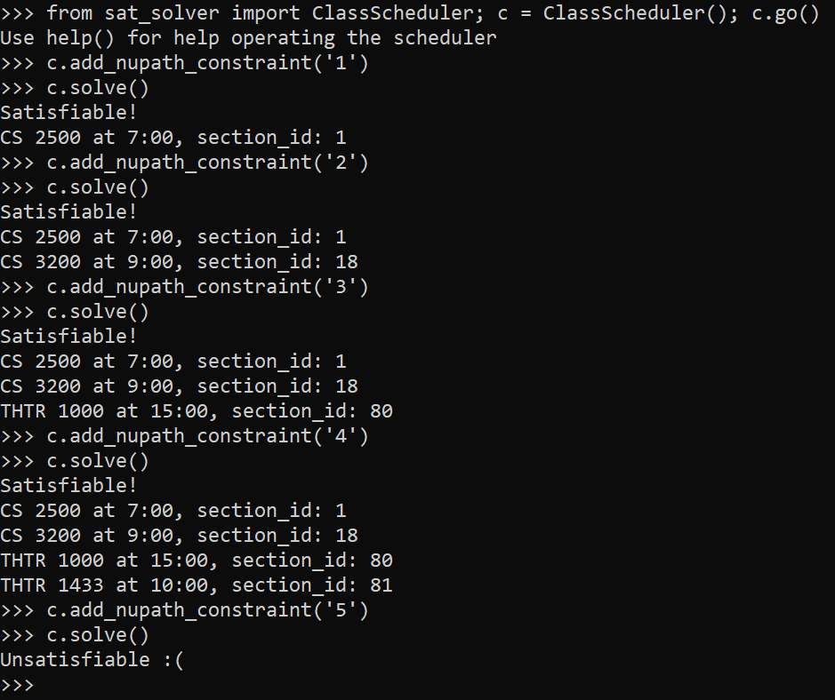

# Midterm Project: Class Scheduler Satisfiability Problem
## Ohm Nabar and Robert Sanders
### Installation Instructions:

  
See Instructions (Click to expand)

  
   To install the sat solver library, you must use a unix based system.  
  Then run the command "pip3 install python-sat".  This should enable the sat solver library to 
  work correctly.  For more help see https://pysathq.github.io/installation.html
  
   To install testing library, in directory, use > "python3 -m pip install pytest"

### General Problem Area:

  
See Problem (Click to expand)

  
   

### Approach:

  
See Approach (Click to expand)

  
   

### Methodology:

  
See Methodology (Click to expand)

  
   

### Results:

  
See Results (Click to expand)

  
 It was really interesting to analyze the output of our Class Scheduler along 
different constraints, and combinations of classes.  We set out a goal to 
find an available schedule when provided with a dataset of classes.  We
successfully completed our goal, as will be demonstrated here.  The sat solver
finds a valid schedule based on the users desired sections, subjects, classes,
timeframe, and nupath constraints. Here we'll walk through some 
examples of the class scheduler to see the behavior it follows.
 
- 

    - In this example we add a full schedule of classes, choosing sections
with different starting times, and of different classes, and as we see
The full schedule is satisfiable.  Then we add 1 more class (ECON
1116), which shouldn't work because we can only take 4 classes, and as
we see the Class Scheduler returns that it is unsatisfiable! 
 
- 

    - This example, adds the first section which is at 7:00, and then adds the 6th section which is also
at 7:00.  This is a contradiction, as we cannot take two classes at the same time, and appropriately so
the Class Scheduler informs the user that this combination of classes is unsatisfiable

- 

    - This example evaluates adding in constraints for each subject.  The Scheduler finds a minimum
     satisfiable section to fit from that subject.  As we see trying to add in a 5th subject would
     not work as you can't take 5 classes.

- 

    - This example adds various nu path constraints, with the scheduler choosing the minimum possible class 
to create a satisfiable schedule.  Here adding a 5th nupath constraint causes an error, as a student
can't take 5 classes.

- 

    - In this example we evalutate time constraints, as this student wants to only take classes between 10:00 
and 16:00.  We try selecting section number 1 for them, which is a 7:00 class, and doesn't fit in their 
time constraints.  Therefore this schedule is unsatisfiable.

- 

    - In this example we evaluate a full schedule of a student with strict time constraints.  The desired
schedule times are from 10:00 to 16:00.  We add the sections 8 and 13.  Then we want to take two more
classes, so we choose those class constraints.  The scheduler chooses sections so as to not interfere
with the prior sections 8 and 13.

- 

    - In this schedule, we set the same time constraints of 10:00 to 16:00, and add 3 exact class constraints.
We then add Philosophy as a subject to find a section of philosophy to fit within those time constraints
and it successfully chooses a generic philosophy class this student could fit into their schedule.

- 

    - In this schedule, we show how a schedule with only 3 hours of time constraints is unsatisfiable when 
choosing 4 classes, as we couldn't choose 4 sections without time overlap.

 The class scheduler can be generalized really well.  We could feed in a real schedule, such as
 Northeastern's Spring 2021 schedule, to find a satisfiable schedule of sections we could take, based
 on which classes we need, which time constraints we have, or even which subject we might need another
  class in.
  
 There are some lingering constraints I would have liked to consider.  To be more helpeful for
upper class students, we could add a way to exclude certain classes from being selected when adding
in a subject constraint.  We wouldn't want the Scheduler to tell a student to take a CS class they've
already taken, so it would be useful for the sat solver to consider already taken classes.

### Summary:

  
See Summary (Click to expand)

  
   

